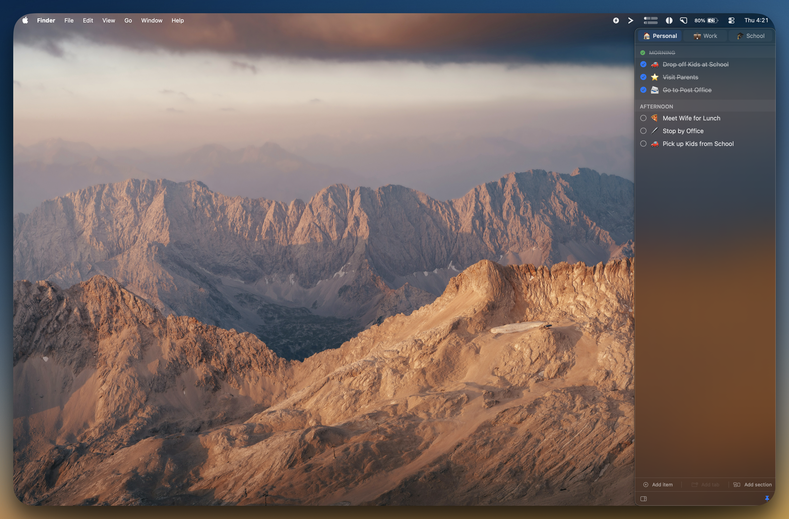
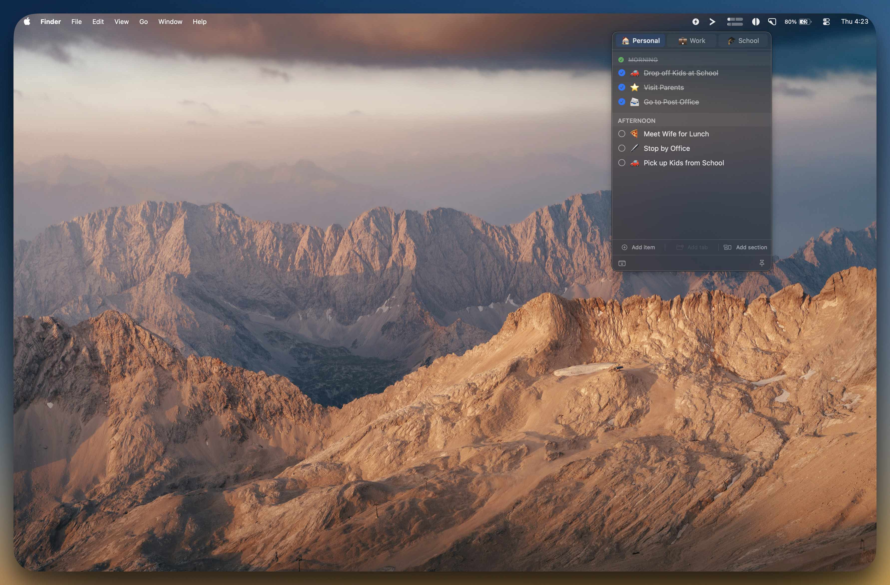
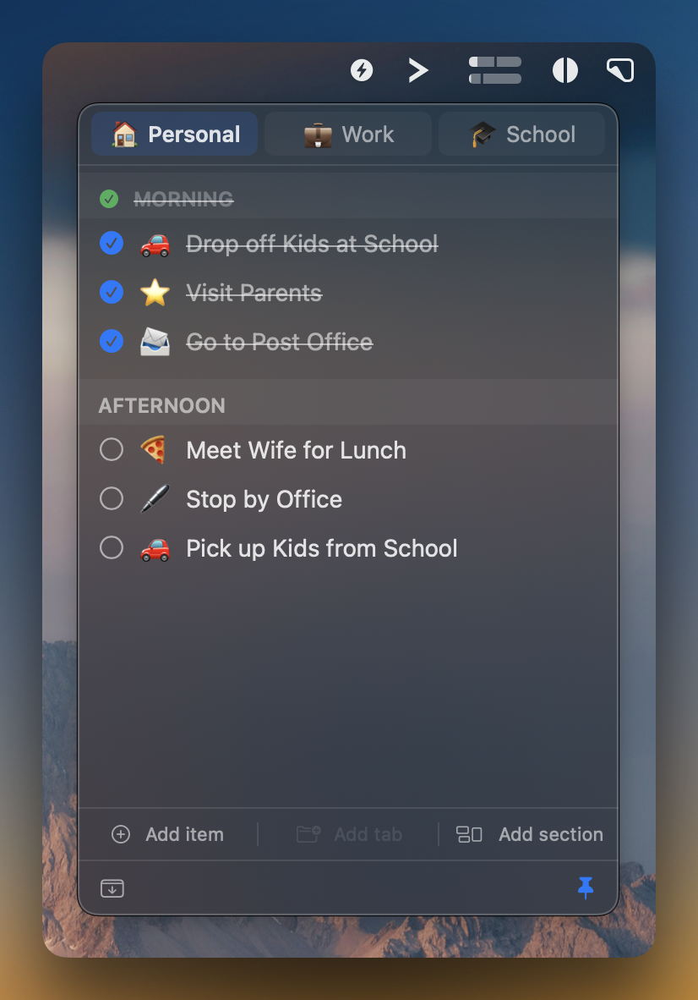
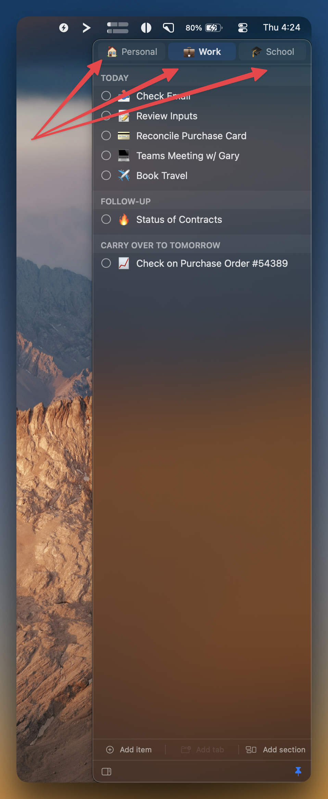
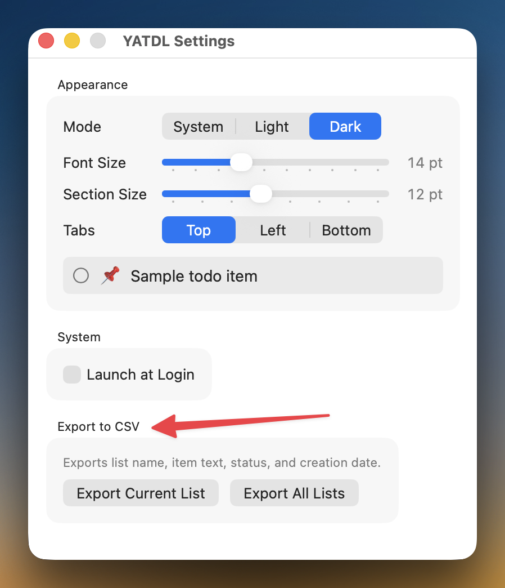
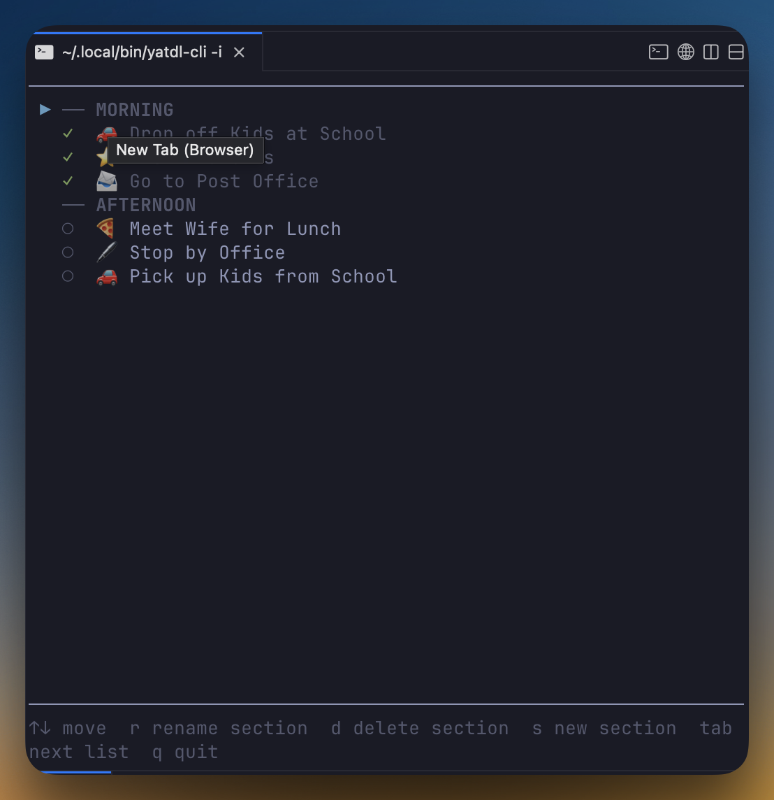
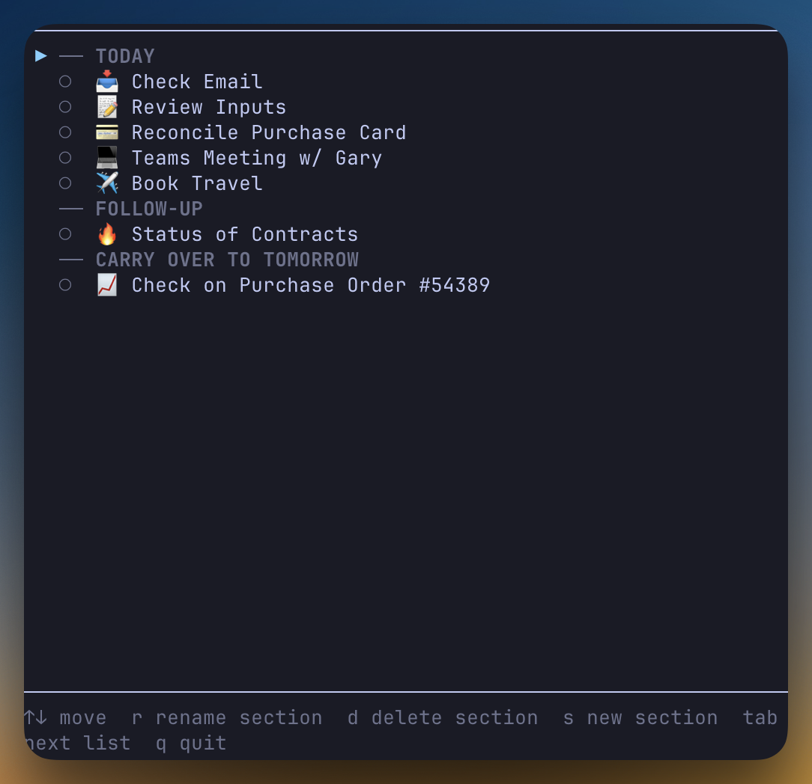

# YATDL — Yet Another To-Do List

A lightweight, native macOS menubar to-do app with a full-screen terminal TUI companion. Built with SwiftUI + AppKit, arm64 native, targeting macOS 14+.

[](LICENSE)

---

## Install

Download **YATDL.dmg** from [Releases](https://github.com/leingangzj/yatdl/releases), open it, and drag YATDL into Applications.

To install the `yatdl` CLI tool, open the app → right-click the menubar icon → **Settings → Install CLI Tool…** — macOS will ask for your password once.

---

## Desktop App

### Drop-down panel

The panel drops directly below the menubar icon. Click the bolt icon or press **Option+Space** from anywhere.



### Slide-in panel

Switch to slide-in mode from the bottom toolbar. The panel glides in from the right edge and nudges your windows aside. Hovering near the right edge opens it automatically.



### Multiple lists and sections

Up to three lists (tabs), each divided into named sections. Tabs fill the panel width evenly and can be reordered by dragging.



### Sections with emoji icons

Each item can carry an emoji icon. Sections show a green ✓ and strikethrough when every item in them is done.



### Settings

Control appearance, font sizes, tab position, launch at login, CLI install, and CSV export.



---

## Features

### Panel & Navigation

| Feature | Detail |
|---|---|
| **Menubar-only** | No Dock icon, no Cmd+Tab entry |
| **Global hotkey** | Option+Space opens or closes the panel from anywhere |
| **Drop-down mode** | Panel drops below the menubar icon |
| **Slide-in mode** | Panel slides in from the right edge and nudges windows aside |
| **Hot-edge hover** | In slide-in mode, hovering near the right edge opens the panel |
| **Pin mode** | Keep the panel open regardless of outside clicks |
| **Appearance** | System, Light, or Dark — switchable in Settings |

### Lists (Tabs)

| Feature | Detail |
|---|---|
| **Up to 3 lists** | Create up to three named lists |
| **Dynamic width** | Tabs fill the panel width evenly |
| **Tab positions** | Top, Bottom, or Left sidebar |
| **Inline create** | Click Add Tab — name it immediately in place |
| **Rename** | Double-click or right-click → Rename |
| **Icons** | Right-click → Set Icon to assign an emoji |
| **Drag to reorder** | Drag tabs to rearrange |
| **Delete with confirmation** | Right-click → Delete List shows a confirmation |

### Sections

| Feature | Detail |
|---|---|
| **Named sections** | Divide any list into sections |
| **Inline create** | Click Add Section — name it immediately in place |
| **Completion indicator** | Green ✓ and strikethrough when all items are done |
| **Drag to reorder** | Drag section headers above, below, or between items |
| **Delete** | Right-click → Delete Section; orphaned items fold into the first section |

### Items

| Feature | Detail |
|---|---|
| **Inline create** | Click Add Item — edit it immediately in place |
| **Check/uncheck** | Click the circle to toggle done; strikethrough applied automatically |
| **Inline edit** | Double-click any item to edit in place |
| **Click-away saves** | Clicking anywhere outside an active edit commits the change |
| **Icons** | Hover a row and click the smiley to assign an emoji |
| **URL items** | Paste any http/https URL — single-click opens it in your browser |
| **Delete** | Hover a row to reveal the × button |
| **Drag to reorder** | Drag items within or between sections |

### Settings

| Feature | Detail |
|---|---|
| **Font size** | Adjustable item font size (11–20 pt) with live preview |
| **Section font size** | Separate size for section headers (9–16 pt) |
| **Appearance** | System / Light / Dark |
| **Tab position** | Top / Left / Bottom |
| **Launch at Login** | Registered with SMAppService |
| **Install CLI Tool** | One-click install of the `yatdl` CLI with a native password prompt |
| **CSV export** | Export current or all lists with List, Section, Item, Done, and Created At columns |

---

## Terminal TUI

`yatdl -i` launches a full-screen terminal interface that reads and writes the same data file as the GUI — changes sync within milliseconds in both directions.

### Personal list with sections



### Work list with multiple sections



### One-shot commands

```
yatdl                  show current list
yatdl lists            show all lists
yatdl use <name>       switch to a list
yatdl add <text>       add item to current list
yatdl done <num>       mark item done
yatdl undo <num>       mark item not done
yatdl rm <num>         remove item
yatdl newtab <name>    create a new list
yatdl rmtab <name>     delete a list
yatdl -i               launch full-screen TUI
yatdl help             show help
```

### TUI keys — on an item

| Key | Action |
|---|---|
| ↑ ↓ / j k | navigate |
| Space | toggle done |
| `a` | add item |
| `e` | edit item text |
| `i` | set emoji icon (blank to clear) |
| `d` | delete item |
| `s` | add section |
| Tab / → | next list |
| Shift+Tab / ← | previous list |
| `n` | new list |
| q / Esc | quit |

### TUI keys — on a section header

| Key | Action |
|---|---|
| ↑ ↓ / j k | navigate |
| `r` | rename section |
| `d` | delete section |
| `s` | add section |
| Tab / → | next list |
| q / Esc | quit |

---

## Bidirectional Sync

Both the app and CLI read and write:

```
~/Library/Application Support/YATDL/data.json
```

The GUI watches that file with a **kqueue-backed DispatchSource** (no polling). Any change made in the CLI appears in the GUI within milliseconds.

---

## Build from Source

> Requires Swift toolchain: `xcode-select --install`

```bash
# GUI app
make app          # builds .build/YATDL.app
make install-app  # installs to /Applications

# CLI
make install      # builds and installs yatdl to /usr/local/bin

# Distributable DMG
make dmg          # produces .build/YATDL.dmg
```

---

## Data Format

```json
{
  "lists": [
    {
      "id": "…",
      "name": "Personal",
      "icon": "📋",
      "sections": [
        {
          "id": "…",
          "name": "Morning",
          "items": [
            { "id": "…", "text": "Drop off kids", "icon": "🚗", "isDone": false, "createdAt": "…" }
          ]
        }
      ]
    }
  ],
  "selectedListID": "…",
  "displayMode": "dropFromMenubar",
  "isPinned": false
}
```

---

## Requirements

- macOS 14.0 (Sonoma) or later
- Apple Silicon (arm64)

---

## License

MIT — see [LICENSE](LICENSE).

## Author

**Zac Leingang** — leingangzj@gmail.com — [github.com/leingangzj/yatdl](https://github.com/leingangzj/yatdl)
